# Azure Cloud SOC Lab — SSH Brute Force Detection & Automated Response

A hands-on cloud security lab built on Microsoft Azure: a deliberately exposed VM, real-world attack traffic (not simulated), a custom KQL detection rule in Microsoft Sentinel, and an automated Logic Apps playbook that alerts on detected incidents.

This project was built to apply and validate skills aligned with the **SC-200 (Security Operations Analyst)** certification path, using only Azure's free-tier services.

---

## Why this project

Most portfolio security labs rely on simulated or staged attacks. This one doesn't — within hours of deploying a VM with SSH open to the internet, **real internet bots found it and began brute-forcing it on their own**. That unsolicited traffic became the actual dataset this project detects and responds to.

---

## Architecture

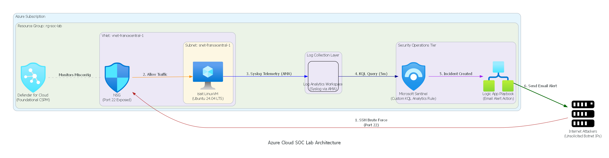

**Components:**
- **Compute:** Azure VM (Ubuntu Server, B1s free tier)
- **Posture management:** Microsoft Defender for Cloud (Foundational CSPM, free)
- **Log collection:** Azure Monitor Agent → Data Collection Rule → Log Analytics Workspace
- **Detection:** Microsoft Sentinel, custom KQL scheduled analytics rule
- **Response:** Sentinel Automation Rule → Logic Apps Playbook → email notification

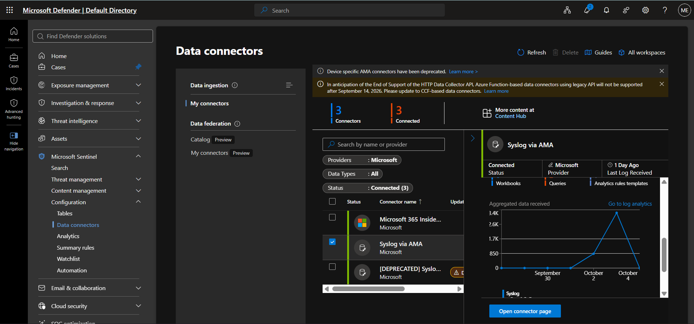

---

## What it detects

The VM was intentionally deployed with SSH (port 22) open to `0.0.0.0/0` to generate genuine attack telemetry. Failed login attempts are collected via Syslog (`auth`/`authpriv` facilities) and analyzed with the following KQL query, run on a 5-minute schedule:

```kql
Syslog
| where SyslogMessage has "Failed password"
| extend SourceIP = extract(@"from (\d{1,3}\.\d{1,3}\.\d{1,3}\.\d{1,3})", 1, SyslogMessage)
| summarize FailedAttempts = count() by SourceIP, Computer, bin(TimeGenerated, 5m)
| where FailedAttempts >= 5
```

An incident is automatically created whenever 5 or more failed logins from a single IP occur within a 5-minute window, with **Host** and **IP** entities mapped for downstream automation.

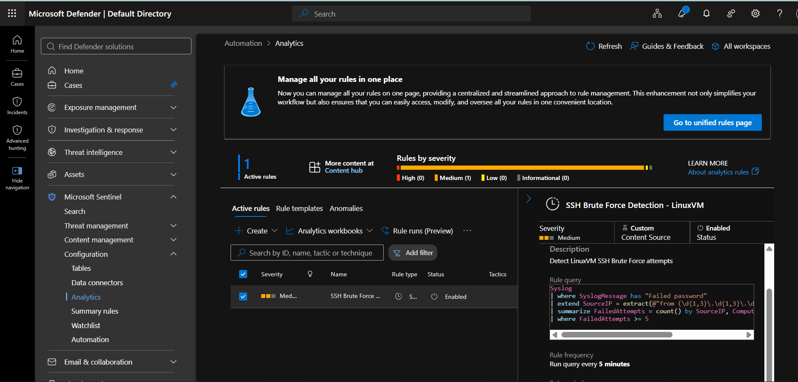

---

## Real-world finding

Within hours of the VM going live, it was attacked by **several( more than 12) distinct unsolicited source IPs** — confirming that unmonitored, internet-facing SSH access is attacked essentially immediately in the wild, with no targeting or staging required.

```kql
Syslog
| where SyslogMessage has "Failed password"
| extend SourceIP = extract(@"from (\d{1,3}\.\d{1,3}\.\d{1,3}\.\d{1,3})", 1, SyslogMessage)
| summarize FailedAttempts = count(), FirstAttempt = min(TimeGenerated), LastAttempt = max(TimeGenerated) by SourceIP, Computer
| order by FailedAttempts desc
```

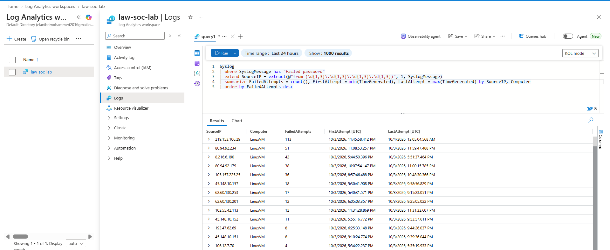
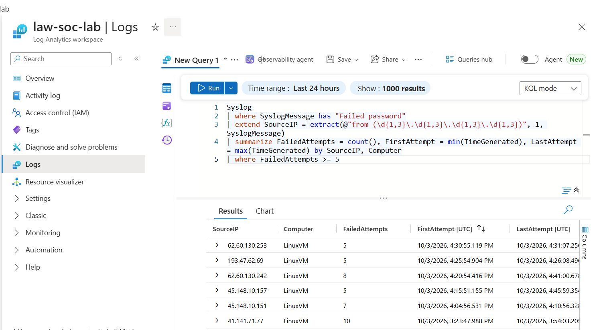

---

## Automated response

When the analytics rule creates an incident, a Sentinel Automation Rule triggers a Logic Apps playbook that:
1. Extracts the attacking IP address(es) from the incident's mapped entities
2. Sends an email alert containing the incident title, severity, and attacker IP

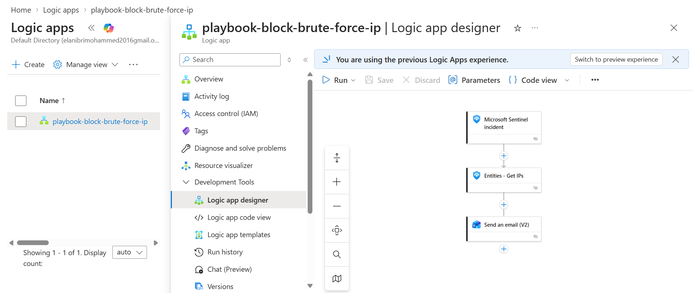
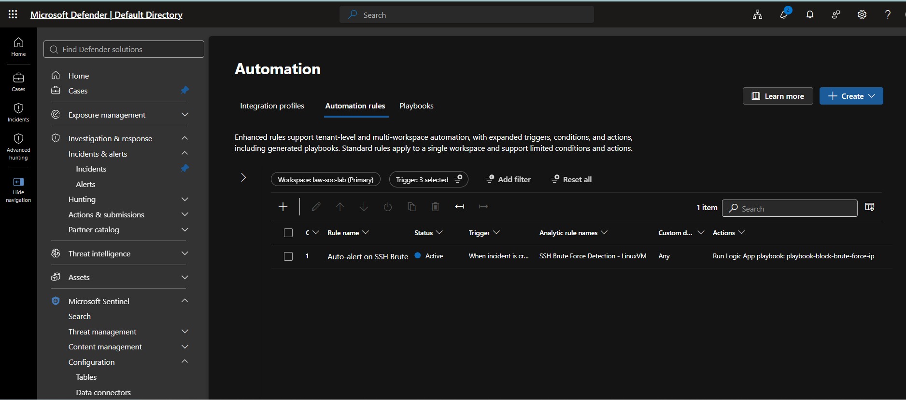
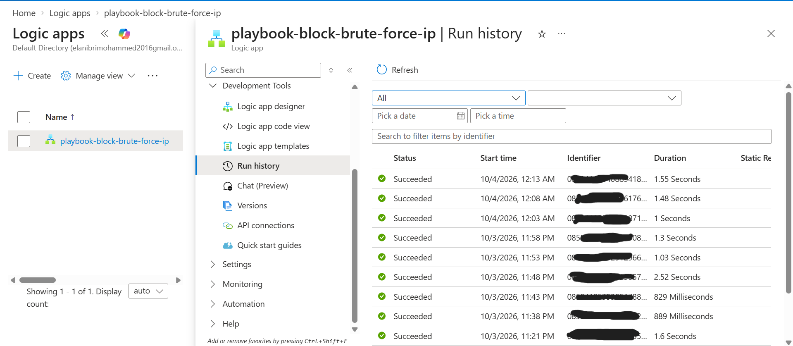
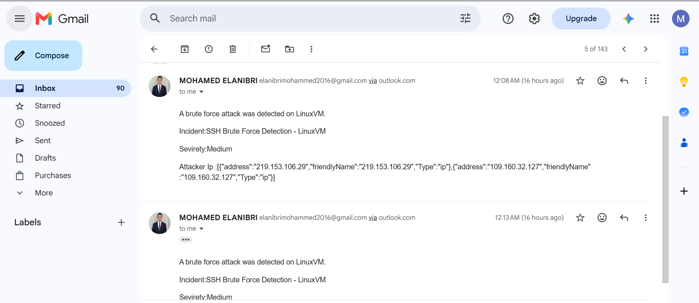

**Future enhancement:** extend the playbook to automatically add a deny rule to the VM's Network Security Group, blocking the attacking IP in real time rather than only notifying. Scoped out of v1 to prioritize a fully working detection-to-notification loop first.

---

## Incidents detected

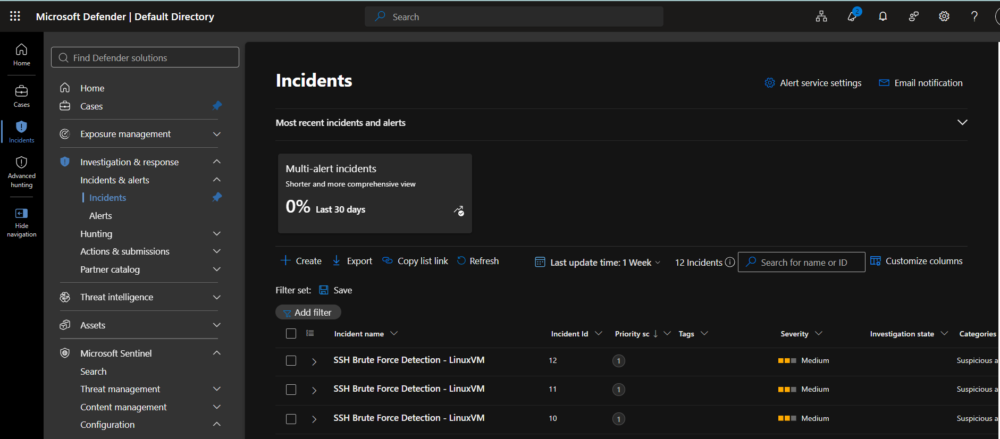
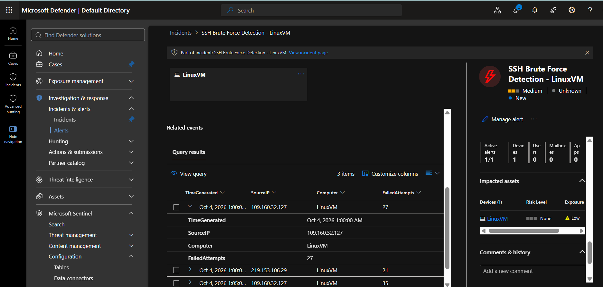

---

## Hardening performed

After capturing attack evidence, the environment was locked down:

| Before | After |
|---|---|
| SSH open to `0.0.0.0/0` | SSH restricted to a single trusted IP |
| 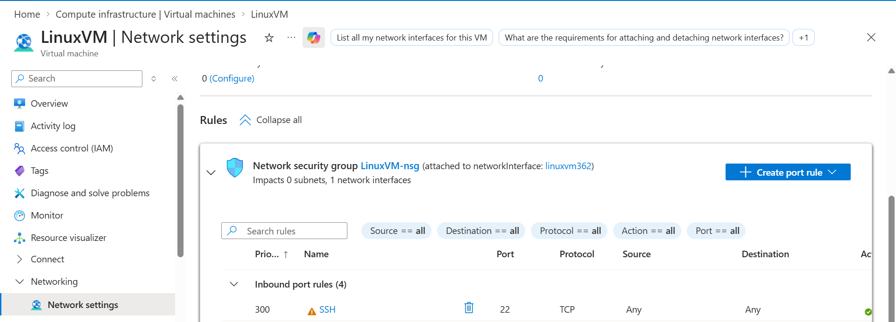 | 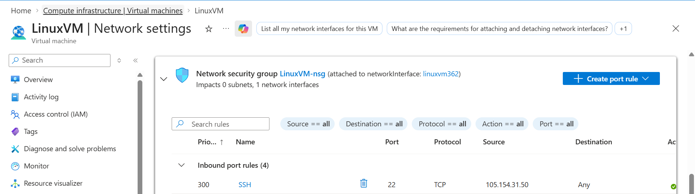 |

Defender for Cloud's Secure Score and recommendations were used to validate the fix:

| Before | After |
|---|---|
| 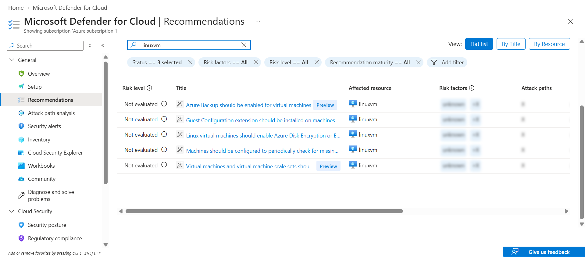 | 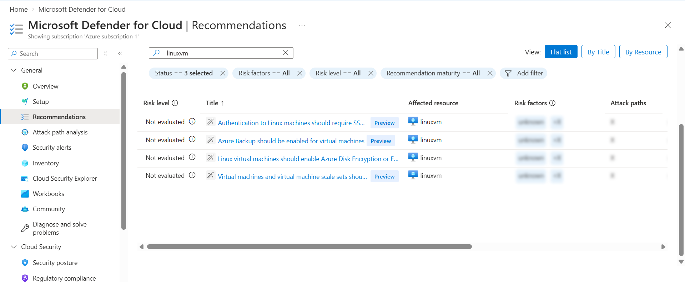 |
| 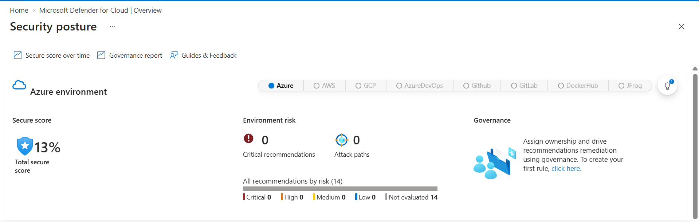 | 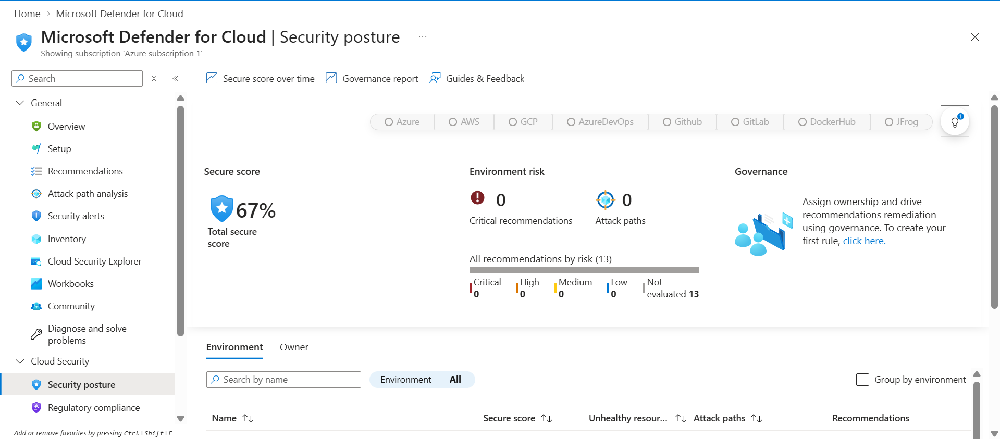 |

The SSH/management-ports exposure finding dropped out of the unresolved recommendations list once the NSG rule was restricted, and Secure Score improved accordingly.

Multi-factor authentication was also enabled on the Azure account, and a $20 cost budget alert was configured from the start to keep the entire project within Azure's free-tier allowances.

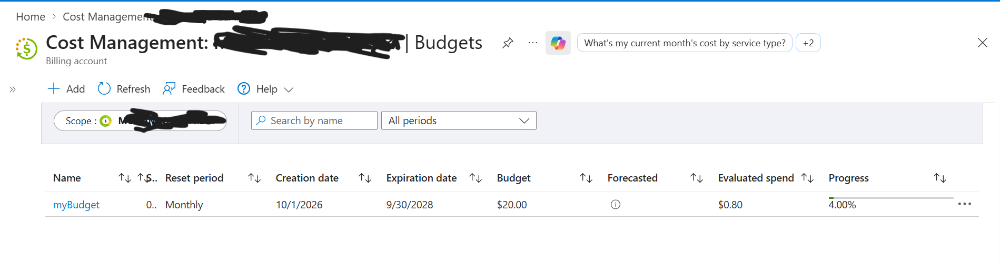

---

## Challenges solved

A non-exhaustive list of real issues debugged during this build — included because troubleshooting cloud infrastructure is most of the actual job:

- **Tenant mismatch (401 error)** authorizing a connector across two Microsoft accounts in the same browser session
- **Data Collection Rule not actually linked to the VM**, despite the Azure Monitor Agent extension showing "Succeeded" — diagnosed via `systemctl` checks and local log inspection on the VM itself, not just the portal UI
- **Sentinel lacking explicit permission** to run the Logic App playbook (`Microsoft Sentinel Automation Contributor` role required)
- **Automation rule silently failing to save** via one UI path; rebuilt successfully from the dedicated Automation blade
- **Gmail connector policy conflict** blocking Sentinel + Gmail connectors in the same workflow; resolved by switching to the Outlook.com connector
- **First alert landed in spam** due to new sender reputation — resolved via Gmail filtering and cleaning up the message body

---

## Tech stack

Azure Virtual Machines · Microsoft Defender for Cloud · Microsoft Sentinel · Log Analytics (KQL) · Azure Monitor Agent · Logic Apps · Microsoft Entra ID

---

## Author

**Elanibri Mohamed**
Cybersecurity & Cloud Computing Engineering Student, ENSAM Casablanca
[LinkedIn](https://www.linkedin.com/in/elanibri-mohamed) · [Portfolio](https://elanibri-mohamed.github.io/portfolio/)
